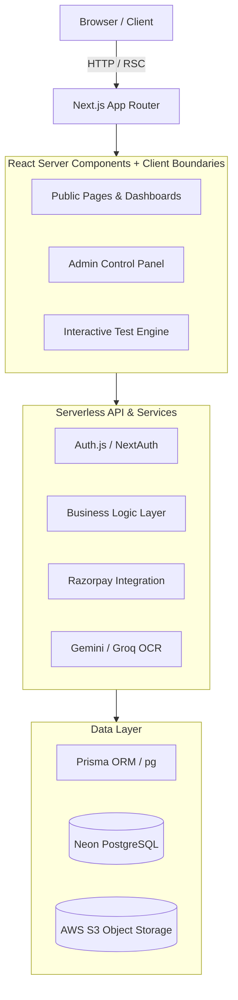

# Nursing Level Up

Nursing Level Up is a comprehensive, production-ready SaaS platform built for nursing students preparing for competitive exams (NORCET, ESIC, RRB, BSc Nursing, etc.). It features an advanced test-taking engine, topic-wise practice modules, daily quizzes, gamified streak tracking, and an e-commerce ecosystem for premium study material.

## Architecture Generated by Archify

The project follows a **Modular Monolith** architecture built on top of the **Next.js App Router**. It is designed for high performance, SEO optimization, and strict type safety.



### Core Technologies
- **Framework:** Next.js 15 (App Router, Server Actions, API Routes)
- **Language:** TypeScript (Strict Mode)
- **Styling:** Tailwind CSS (v4) with highly customized utility classes
- **Database:** PostgreSQL (hosted on Neon)
- **ORM / Data Layer:** Prisma ORM & raw `pg` queries
- **Authentication:** Auth.js (NextAuth v5) with Google OAuth & Dev Login
- **Payments:** Razorpay Webhooks and Orders API
- **AI / OCR:** Google Gemini 2.0 / Groq / Tesseract.js

---

## Codebase Structure

The source code is cleanly organized into functional boundaries within `src/`:

- **`src/app/`**: Next.js App Router structure.
  - `(site)/`: Public-facing website, student dashboards, practice pages, and test browser.
  - `admin/`: Secured admin dashboard for taxonomy, product, and question bank management.
  - `api/`: REST endpoints serving the client components and webhooks.
- **`src/components/`**: Reusable React components.
  - `ui/`: Design system (buttons, cards, inputs, empty states).
  - `test/`: The core test runner, timers, and practice modules.
  - `admin/`: Admin UI components (WYSIWYG question editor, stat cards).
- **`src/lib/server/services/`**: The core backend business logic. Separated by domain (`catalogService.ts`, `dailyQuizService.ts`, `productService.ts`, etc.).
- **`prisma/`**: Contains the `schema.prisma` file defining the database schema.

---

## How to Clone and Setup

To get a local copy up and running, follow these simple steps:

### 1. Prerequisites
- **Node.js** (v18 or higher recommended)
- **npm** (v9 or higher)
- **Git**

### 2. Clone the Repository
```bash
git clone https://github.com/ayshrosine/Nurse_PNX.git
cd Nurse_PNX
```

### 3. Install Dependencies
Install all required NPM packages.
```bash
npm install
```

### 4. Environment Variables
Create a `.env.local` file in the root of the project by copying the example file:
```bash
cp .env.example .env.local
```
Fill in the necessary values in `.env.local`:
- `DATABASE_URL`: Your PostgreSQL connection string.
- `AUTH_SECRET`: Generate a random string (e.g., `openssl rand -base64 32`).
- `GOOGLE_CLIENT_ID` / `SECRET`: For Google OAuth login.
- `RAZORPAY_KEY_ID` / `SECRET`: For payment processing.

---

## How to Run the Project

### Database Setup
Ensure your database is up to date with the latest schema. Run the Prisma migrations:
```bash
npx prisma generate
npx prisma db push
```
*(Note: If migrating from the legacy raw SQL setup, ensure your Neon database contains the initial tables prior to generating the client).*

### Development Server
Start the Next.js development server:
```bash
npm run dev
```
Open [http://localhost:3000](http://localhost:3000) in your browser. 

### Production Build
To create an optimized production build:
```bash
npm run build
npm start
```

## Features Overview

1. **Taxonomy & Catalog System:** Courses are organized hierarchically: Programs (NORCET) -> Subjects -> Topics.
2. **Advanced Test Engine:** A highly resilient client-side test runner. Features include local autosaving, mark-for-review, grid navigation, and strict server-side score calculation.
3. **Practice & Daily Quizzes:** Untimed practice modes with immediate feedback, and daily rotating free quizzes with streak gamification.
4. **E-Commerce & Entitlements:** Students can purchase specific test series or global "Packs" via Razorpay. Entitlements are securely enforced on the backend.
5. **AI Import Pipeline:** Admins can import unstructured question banks (Word docs, PDFs) using an automated OCR and LLM pipeline that extracts and structures questions and options perfectly.